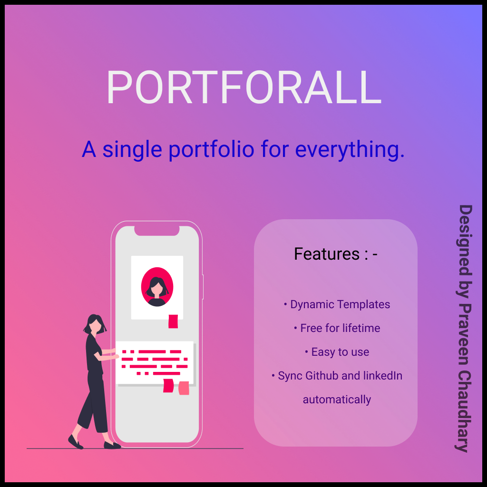

## **Portforall**
This project will make user's portfolio. These portfolio's are dynamic with tons of templates and gradient colours which changes on every refresh. This project is backend with django framework.

 

 

#### **Why Porforall?**
1. Showing resume is outdated.
2. Traditional resume's are less attractive
3. Easily accessible
4. Integrates all your profiles such as Instagram, LinkedIn, Github and many more.
5. Tons of templates.

##### **Terms and conditions**
No conditions are applicable. Not a direct or a indirect help is required.

It is a Open source project. You all can edit and modify the project. You are able to use this template anywhere.